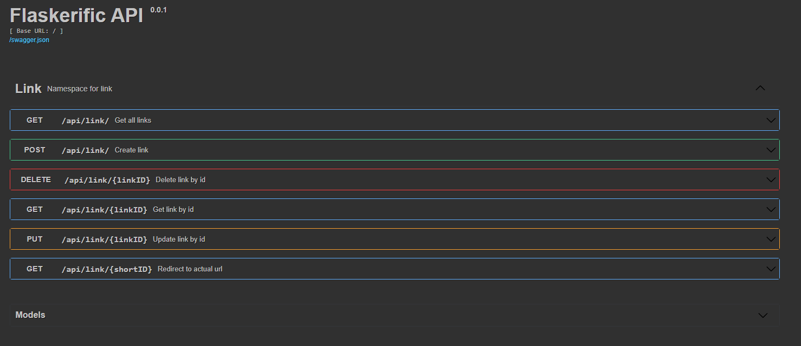

#Flask API for link shortening


API has several endpoints that can be tried out manually via swagger



These endpoints give the ability to:
 - get all links in database
 - create a link 
 - delete a link 
 - get a link from db
 - update a link
 - use shortened link 

Once a day program checks for expired links and deletes them.

## Running the app

To run the docker image you need to have docker installed on your machine.

To build the docker images use 
```
docker-compose -f docker-compose.dev.yml up --build
docker-compose -f docker-compose.prod.yml up --build
```

After the container is up, open another terminal window and run
```
sudo docker exec -ti wsgi sh
```
to get inside the container.

Next, initialize the database, by running
```
python manage.py seed_db
```

Navigate to the posted URL in your terminal to be greeted with Swagger, where you can test out the API.

To down the container use
```
docker-compose -f docker-compose.dev.yml down --volumes --remove-orphans
```
or 

```
docker-compose -f docker-compose.prod.yml down --volumes --remove-orphans
```
depending on the configuration you chose

## Running tests

To run the tests just use testing image
```
docker-compose -f docker-compose.prod.yml up --build --abort-on-container-exit
```

